# VPC ASSIGNMENT 1

### Lab 4.1.1: New VPC with "Private" Subnet

1. By using cloudformation template "vpc-subnet-4.1.1.yaml" one stack named "vpc-assignment-1" was created.

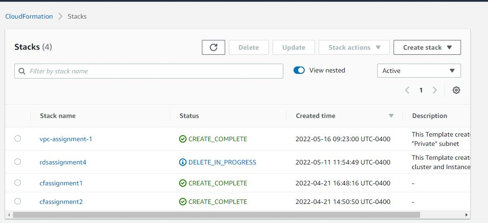

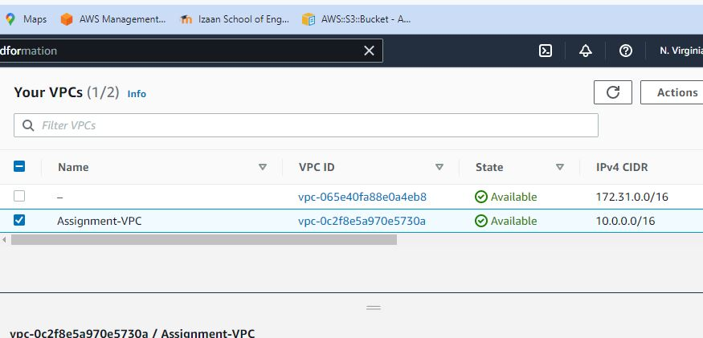

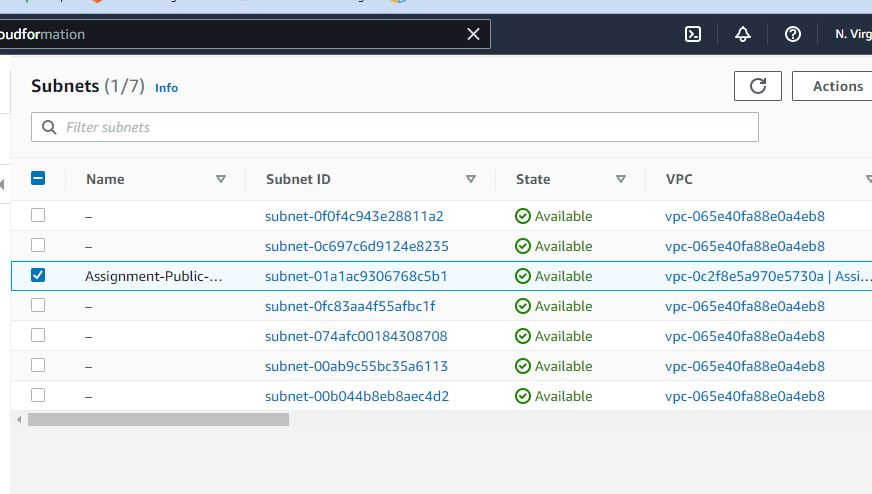

2. And the following output was found from the template.

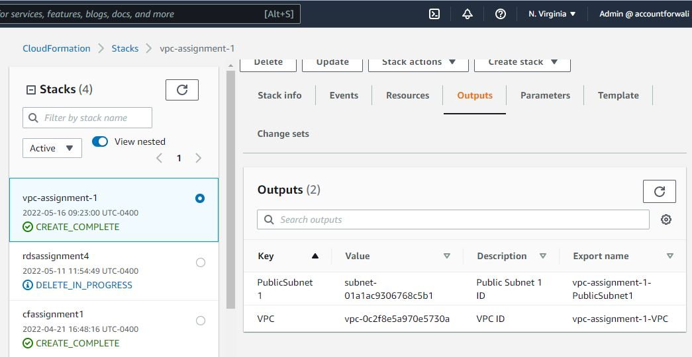

3. Following aws cli command was executed:

```
aws cloudformation create-stack --stack-name vpc-assignment-1 --template-body file://vpc-subnet-4.1.1.yaml --parameters file://parameters.json 
```

### Lab 4.1.2: Internet Gateway

1. By using cloudformation template "vpc-igw-4.1.2.yaml" and stack named "vpc-assignment-2" was created.

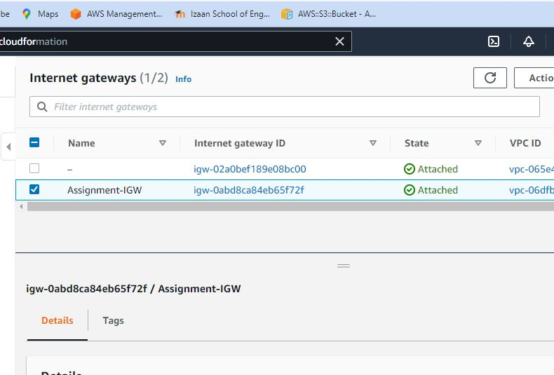

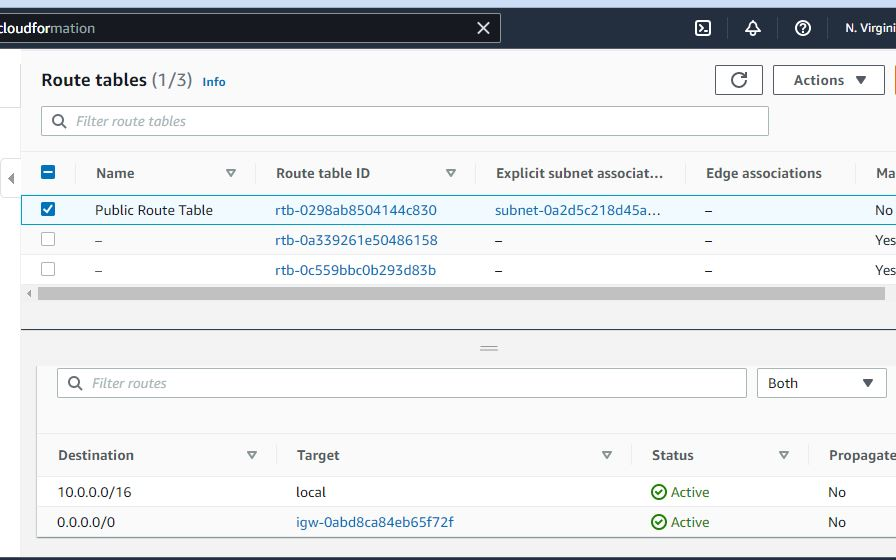

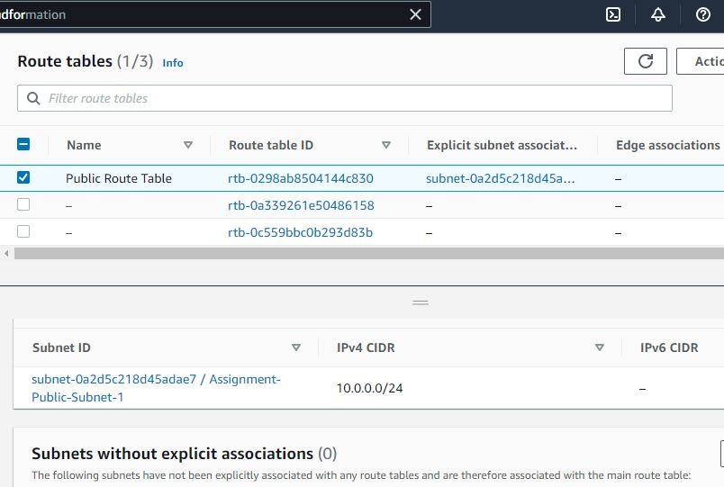

### Lab 4.1.3: EC2 Key Pair

1. EC2 key pair is created following below aws CLI command:

$ aws ec2 create-key-pair --key-name vpc-key-pair --query 'KeyMaterial' --output text > vpc-key-pair.pem

2. The output is saved in my project directory.

3. The Key-pair is created in the same region I will be doing this lab. i.e N.Virginia

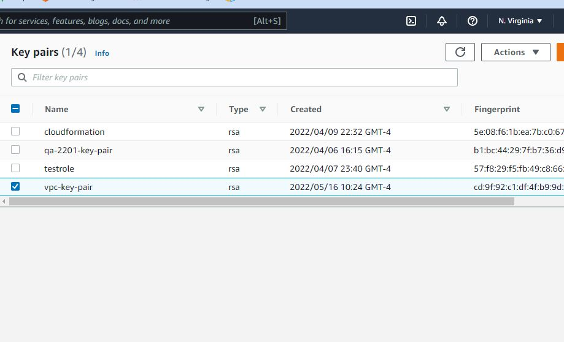

### Lab 4.1.4: Test Instance

1. Separate CFN template named 'vpc-ec2-4.1.4.yaml' created.
2. Where subnet and VPC was referenced the output from VPC stack.
3. Latest Amazon Linux AMI was used.
4. A parameter file is created named 'ec2-parameter.json' where EC@ AMI ID, T2 instance type and the name of key pair 
was included.
5. Instance ID and IP is put as output.
6. Stack was created by following command:

```
aws cloudformation create-stack --stack-name vpc-ec2 --template-body file://vpc-ec2-4.1.4.yaml --parameters file://ec2-parameter.json
```
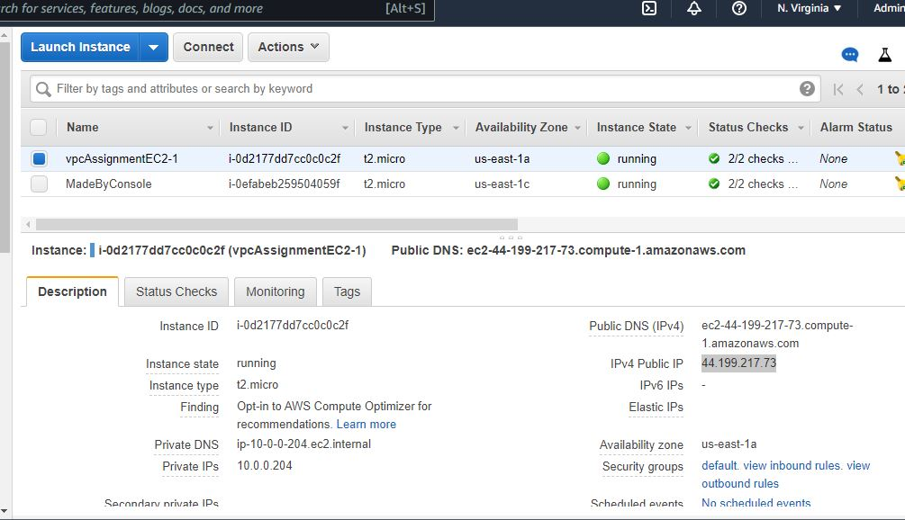

### Q. After you launch your new stack, can you ssh to the instance?

Ans: No, I cannot SSH to the instance.

### Q. Is there a way that you can verify Internet connectivity from the instance without ssh'ing to it?

Ans: Yes, by sending ping.

### Lab 4.1.5: Security Group

1. Security group is added in the template and named as vpc-ec2-sg-4.1.5.yaml and executed
by following command:

```aws cloudformation create-stack --stack-name vpc-ec2-sg-2 --template-body file://vpc-ec2-sg-4.1.5.yaml --parameter file://ec2-parameter.json```

### Can you ssh to your instance yet?

Ans: No I cannot SSH

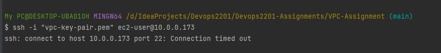

### Lab 4.1.6: Elastic IP

1. An Elastic IP is added in vpc-ec2-ep-4.1.6.yaml

### Q. Can you ping your instance now?

Ans. Yes, I can.

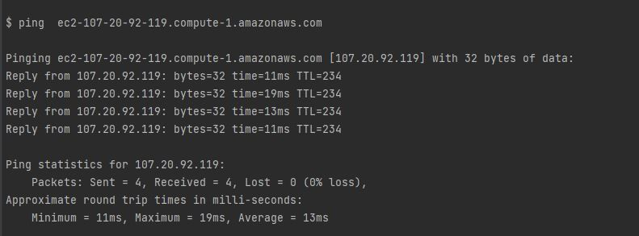

### Q. Can you ssh into your instance now?

Ans. Yes, I can.

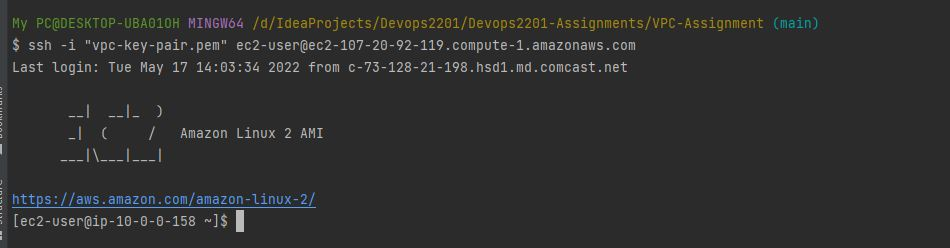

### If you can ssh, can you send any traffic (e.g. curl) out to the Internet?

Ans. Yes, I can.

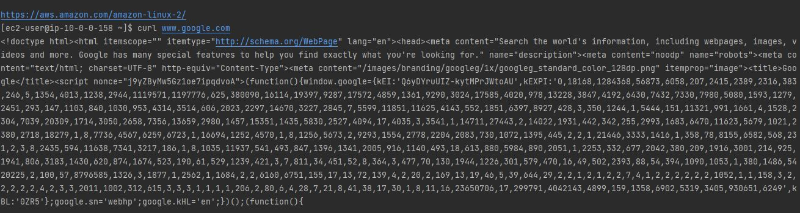

### Lab 4.1.7: NAT Gateway

1. VPC template/stack is updated by adding a NAT gateway.

### Q. Can you find a way to ssh to this instance?

Ans. 


